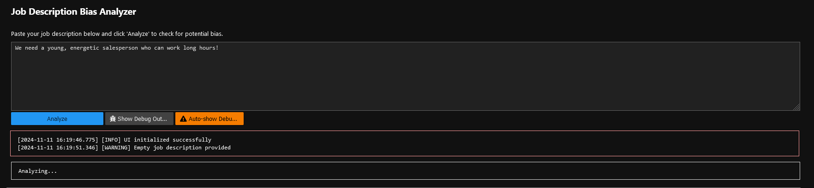
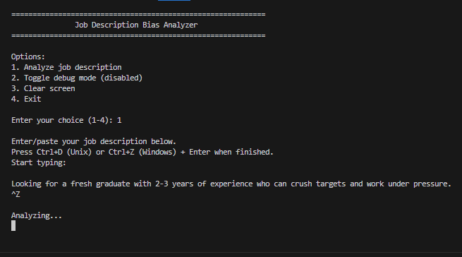

# Job Bias Analyzer: Promoting Gender Equality Through AI-Powered Job Description Analysis (job_bias_detector)

**Author:** [PGCHM](https://github.com/PGCHM)

**GitHub Repo:** https://github.com/PGCHM/job_bias_detector

**Banner Image Provided by** https://www.vectorstock.com/royalty-free-vector/

The Job Bias Analyzer is an innovative AI-powered tool designed to identify and eliminate discriminatory language and implicit bias in job descriptions and hiring materials. By leveraging natural language processing and machine learning techniques, this tool actively contributes to achieving UN Sustainable Development Goal 5 (Gender Equality) by promoting equal opportunities in the workforce through inclusive job postings. This tool could help companies identify and eliminate unintentional biases in recruitment materials, promoting a more inclusive hiring process. Google’s Gemini APIs are used to detect and suggest gender-neutral language.


## Needs, Impacts and Relevance

The project tackles a critical issue in workforce equality: unconscious bias in job descriptions that can discourage women and LGBTQ groups from applying for positions. Research shows that gendered language in job postings can reduce women's application rates by up to 40%. This tool directly addresses UN SDG target 5.1 (ending discrimination against women) and 5.5 (ensuring equal opportunities in economic life) by helping organizations create more inclusive job postings.

As for potential for positive impact, the tool offers immediate and scalable impact through (1) Real-time analysis of job descriptions, (2) Specific recommendations for bias-free alternatives, (3) Educational feedback that helps writers understand why certain terms are problematic, (4) Database-backed learning system that improves recommendations over time, (5) Easy integration into existing hiring workflows, and (6) Cross-platform accessibility through command-line interface.

In alignment with Women's Empowerment, the analyzer promotes gender equality by: (a) Identifying and eliminating gender-coded language, (b) Challenging traditional role stereotypes in job requirements, (c) Promoting inclusive leadership opportunities, (d) Addressing intersectional biases related to age, race, and other characteristics, and (e) Supporting organizational diversity and inclusion initiatives.


## Project Introduction

The AI-Powered Discrimination Detector for Job Listings focuses on using natural language processing (NLP) to identify potentially discriminatory or gender-biased language in job descriptions. Here’s a basic workflow it supports:

1. Data Collection: Collect job listings from various sources.


2. Bias Identification: Use NLP to flag potentially biased words or phrases that may discourage diverse candidates, particularly women.


3. Suggesting Alternatives: Offer recommendations for neutral, inclusive language to replace flagged phrases.


4. Feedback Loop: Gather feedback from users (HR professionals, job seekers) to improve detection accuracy and recommendations.


## Methodologies

Google Gemini AI, Google's new foundation model, excels in language processing tasks and can aid in analyzing and generating text to enhance inclusivity. Here’s a breakdown of how we proceed to build this tool with Google Gemini APIs:

1. Define the Types of Bias to Detect

 - Gendered words (e.g., `ninja`, `rockstar` vs. `team player`, `leader`)
 - Language implying age or experience bias (e.g., `young, energetic team`)
 - Requirements that might exclude certain demographics (e.g., unnecessary physical requirements)
 - Gender pronouns or assumptions (e.g., `he/she` instead of `they`)


2. Data Preparation and Annotation

 - Dataset: Start with publicly available job listings or scrape from job portals. You could also use synthetic examples if live data is hard to obtain.
 - Labeling: Label phrases or words associated with potential biases. Common NLP labeling platforms, such as Google’s Data Labeling Service, could help create training data if your project scales up.


3. Leverage Google Gemini AI for Initial Analysis

 - Text Embedding and Analysis: Use Gemini’s text embeddings to analyze language. Embeddings capture the context and sentiment in words, helping you identify subtle biases.
 - Fine-Tuning: Fine-tune Gemini with your labeled dataset to detect specific biases in job descriptions. Google’s AI Platform offers tools for fine-tuning to capture nuances in biased language.


4. Flagging and Recommending Inclusive Language

 - Bias Detection: Use Gemini to build a model that can score job postings for inclusivity based on predefined keywords and contextual analysis.
 - Generate Recommendations: For flagged terms, use Gemini’s language generation capabilities to suggest alternatives. For example, change `aggressive salesperson` to `results-driven salesperson`.
 - Implementation: build a simple feedback system that allows HR users to mark suggestions as `helpful` or `not helpful`, refining the model’s suggestions over time.


5. Deploy and Create an Easy-to-Use Interface

 - Web App or API: Consider building a web application or API. Using Google Cloud’s App Engine or Firebase could simplify deployment.
 - User Dashboard: Create a dashboard for users to paste in job descriptions and view flagged terms with recommendations.


## Key Resources and Tools

1. Gemini Language API: For NLP and text generation, providing recommendations for inclusivity in job postings.


2. Google Cloud AI Platform: For training and fine-tuning the model if you’re building it on labeled job description data.


3. Google App Engine / Firebase: To deploy the web app or API.


4. Data Labeling Service: To assist in creating labeled datasets to fine-tune Gemini.


## Example Use Cases and Outputs

Here's a look at what this tool might detect and suggest:

1. Detection:

Job Description: `We need a young, energetic salesperson.`

Flagged Terms: `young, energetic`

Suggestion: Replace with `motivated, proactive`


2. Detection:

Job Description: `We are looking for a sales ninja who will crush targets!`

Flagged Terms: `ninja, crush targets`

Suggestion: Replace with `experienced sales professional with a strong record of achieving targets`


3. Detection:

Job Description: `We need someone willing to work long hours in a fast-paced environment.`

Flagged Terms: `long hours`

Suggestion: Replace with `flexible schedule based on project needs`


## Procedures

We want to create this AI tool that will be composed of these functionalities:

 - a Python script that can generate a detailed report identifying biased language, suggesting improvements, and providing a bias-free version of the job description. The report will be both printed to console and saved to a file.
 - a Simple UI component or a interactive CDL that can have users (e.g., HR) paste in the job description, identify any potential biases, recommend the fixes, and have users review whether this is helpful or not.
 - a Feedback loop that collects users' reviews, save into database(s), and feed back into the AI tool when predicting for next prompt.


The Python script `job_bias_detector_args.py` provides:

 - A `JobBiasDetector` class that:
   - Initializes the Gemini AI model
   - Creates structured prompts for analysis
   - Analyzes job descriptions for bias
   - Generates detailed reports
 - Key features:
   - Detects discriminatory language related to age, gender, and other protected characteristics
   - Provides specific term-by-term analysis with suggestions
   - Assigns a discrimination score (0-10) and confidence level
   - Generates an improved, bias-free version of the description
   - Creates detailed reports that can be saved to files
 - The analysis includes:
   - Flagged problematic terms
   - Explanations of why terms are problematic
   - Suggested replacements
   - Overall discrimination score
   - Confidence level of the analysis
   - Complete rewritten job description


To break into details, the AI tool has been accomplished with these steps:


### Step 0: Initialize the Google AI Platform (with Google Gemini)

Install the dependency using pip:
```
!pip install -U google-generativeai
!pip install google-auth-oauthlib
!pip install ipywidgets
!pip install aiohttp  # if using async HTTP requests
!jupyter nbextension enable --py widgetsnbextension
!jupyter labextension install @jupyter-widgets/jupyterlab-manager
```

Import the package and configure the service with your API key:
```
import google.generativeai as genai
genai.configure(api_key='YOUR_API_KEY')
```


### Step 1: Set up the disctionary of biased terms 

Example list of biased words/phrases and their inclusive alternatives
```
bias_dict = {
            "young": {
                "categories": ["age discrimination", "direct discrimination"],
                "replacement": "motivated",
                "explanation": "Directly discriminates against older workers and violates age discrimination laws"
            },
            "energetic": {
                "categories": ["age discrimination", "indirect discrimination"],
                "replacement": "enthusiastic",
                "explanation": "Often used as coded language for age discrimination and may discourage older applicants"
            },
            "ninja": {
                "categories": ["unprofessional language", "cultural appropriation"],
                "replacement": "skilled professional",
                "explanation": "Uses casual language that may be inappropriate and culturally insensitive"
            },
            "crush targets": {
                "categories": ["aggressive language", "toxic culture"],
                "replacement": "achieve sales goals",
                "explanation": "Promotes aggressive behavior and may indicate toxic work environment"
            },
            "long hours": {
                "categories": ["work-life balance", "indirect discrimination"],
                "replacement": "flexible schedule based on project needs",
                "explanation": "May discriminate against caregivers and promote unhealthy work-life balance"
            }
        }
```


### Step 2: Use Gemini API to provide analysis on inclusivity context

The key aspects of step 2 is that:
 - Split the prompt into two parts:
   - Initial system prompt (`_create_initial_prompt`) that sets up the analysis framework
   - Analysis prompt (`_create_analysis_prompt`) for each specific job description
 - Modified `analyze_job_description` to:
   - Maintain conversation context
   - Handle the multi-turn conversation format
   - Store and use previous context for better analysis
 - Added `analyze_multiple_descriptions` method to:
   - Process multiple job descriptions while maintaining context
   - Return analyses for all descriptions


```
def _create_initial_prompt(self) -> str:
    """Create the initial system prompt explaining the task."""
    bias_terms_json = json.dumps(self.bias_dict, indent=2)

    return f"""You are a job description analyzer specialized in detecting discriminatory language.
    You will analyze job descriptions using these predefined problematic terms and categories:

    {bias_terms_json}

    For each job description, provide analysis in this JSON format:
    {{
        "flagged_terms": [
            {{
                "term": "exact problematic phrase",
                "categories": ["list", "of", "discrimination", "categories"],
                "context": "full sentence containing the term",
                "explanation": "detailed explanation of why this is problematic",
                "suggestion": "specific replacement text",
                "severity": "number 1-5, where 5 is most severe",
                "compounding_effects": "explanation of how this term combines with others"
            }}
        ],
        "discrimination_score": "number 0-10",
        "confidence_level": "number 0-1",
        "discrimination_categories": {{
            "age_discrimination": {{
                "count": "number of instances",
                "severity": "average severity 1-5",
                "terms": ["list of terms"]
            }},
            "unprofessional_language": {{
                "count": "number of instances",
                "severity": "average severity 1-5",
                "terms": ["list of terms"]
            }},
            "work_life_balance": {{
                "count": "number of instances",
                "severity": "average severity 1-5",
                "terms": ["list of terms"]
            }},
            "aggressive_language": {{
                "count": "number of instances",
                "severity": "average severity 1-5",
                "terms": ["list of terms"]
            }}
        }},
        "compounding_effects_summary": "explanation of how multiple biased terms interact",
        "overall_risk_assessment": "analysis of legal and ethical risks",
        "improved_description": "rewritten job description removing all biased language"
    }}"""

def _create_analysis_prompt(self, job_description: str) -> str:
    """Create the prompt for analyzing a specific job description."""
    return f"""Analyze this job description for discriminatory language, considering all previous guidelines:

    Job Description:
    {job_description}

    Provide your analysis in the specified JSON format."""

async def analyze_job_description(self, job_description: str) -> Dict[str, Any]:
    """Analyze a job description for bias and discrimination using conversation history."""
    try:
        # Start new conversation if this is the first analysis
        if not self.messages:
            initial_prompt = self._create_initial_prompt()
            self.messages = [
                {'role': 'user', 'parts': [initial_prompt]}
            ]
            response = self.model.generate_content(self.messages)
            self.messages.append(response.candidates[0].content)

        # Add the job description analysis request
        analysis_prompt = self._create_analysis_prompt(job_description)
        self.messages.append({'role': 'user', 'parts': [analysis_prompt]})

        # Get the analysis
        response = self.model.generate_content(self.messages)

        # Add the response to conversation history
        self.messages.append(response.candidates[0].content)

        # Parse and return the analysis
        return response.text

    except Exception as e:
        return {
            "error": f"Analysis failed: {str(e)}",
            "flagged_terms": [],
            "discrimination_score": 0,
            "confidence_level": 0,
            "discrimination_categories": {
                "age_discrimination": {"count": 0, "severity": 0, "terms": []},
                "unprofessional_language": {"count": 0, "severity": 0, "terms": []},
                "work_life_balance": {"count": 0, "severity": 0, "terms": []},
                "aggressive_language": {"count": 0, "severity": 0, "terms": []}
            },
            "compounding_effects_summary": "Analysis failed",
            "overall_risk_assessment": "Analysis failed",
            "improved_description": job_description
        }

async def analyze_multiple_descriptions(self, descriptions: List[str]) -> List[Dict[str, Any]]:
    """Analyze multiple job descriptions while maintaining conversation context."""
    results = []
    for description in descriptions:
        analysis = await self.analyze_job_description(description)
        results.append(analysis)
    return results
```


### Step 3: Flag and recommend alternatives

The script `job_bias_detector_args.py` is to accept job descriptions from command line arguments instead of hardcoding them, and includes several improvements:

 - Added command-line argument parsing using argparse
 - Supports two ways to input job descriptions: (1) Directly as command-line arguments, or (2) Through a text file (one description per line)
 - Added customizable output directory option
 - Improved error handling
 - Added helpful usage examples in the help text

#### 3.1. Analyze single job description
```
!python job_bias_detector_args.py "We need a young, energetic salesperson who can work long hours!"
```
Output from analyzer:
```
Analysis Report 1:
Job Description Bias Analysis Report
                ================================================================================

                OVERALL METRICS
                ----------------------------------------
                Discrimination Score: 8/10
                Confidence Level: 95.0%

                DISCRIMINATION CATEGORIES ANALYSIS
                ----------------------------------------

Age Discrimination:
  Instances: 2
  Average Severity: 4.5/5
  Problematic Terms: young, energetic

Unprofessional Language:
  Instances: 0
  Average Severity: 0/5
  Problematic Terms: 

Work Life Balance:
  Instances: 1
  Average Severity: 4/5
  Problematic Terms: long hours

Aggressive Language:
  Instances: 0
  Average Severity: 0/5
  Problematic Terms: 

DETAILED TERM ANALYSIS
----------------------------------------

Flagged Term: young
Categories: age discrimination, direct discrimination
Context: "We need a young, energetic salesperson who can work long hours!"
Severity: 5/5
Explanation: Directly discriminates against older workers and violates age discrimination laws.
Compounding Effects: This term, along with "energetic" and "long hours", creates a compounded discriminatory effect against older workers and those with family responsibilities.
Suggested Replacement: motivated

Flagged Term: energetic
Categories: age discrimination, indirect discrimination
Context: "We need a young, energetic salesperson who can work long hours!"
Severity: 4/5
Explanation: Often used as coded language for age discrimination and may discourage older applicants.
Compounding Effects: Reinforces the age bias along with "young" and potentially suggests an expectation of a fast-paced work environment that might not be suitable for all ages.
Suggested Replacement: enthusiastic

Flagged Term: long hours
Categories: work-life balance, indirect discrimination
Context: "We need a young, energetic salesperson who can work long hours!"
Severity: 4/5
Explanation: May discriminate against caregivers and promote unhealthy work-life balance.
Compounding Effects: Combined with "young" and "energetic", this phrase further marginalizes older workers and those with caregiving responsibilities who may have less flexibility in their schedules.
Suggested Replacement: flexible schedule based on project needs

COMPOUNDING EFFECTS SUMMARY
----------------------------------------
The combined use of "young", "energetic", and "long hours" creates a strong bias against older workers, those with family responsibilities, and individuals seeking a healthy work-life balance. This combination paints a picture of a demanding work environment that may not be inclusive of diverse needs and lifestyles.

RISK ASSESSMENT
----------------------------------------
This job description poses significant legal risks due to potential age discrimination and violations related to work-life balance. It may also negatively impact the company's image and deter qualified candidates from applying.

IMPROVED JOB DESCRIPTION
----------------------------------------
We need a motivated and enthusiastic salesperson with a flexible schedule based on project needs.

================================================================================
```


#### 3.2. Analyze multiple job descriptions
```
!python job_bias_detector_args.py "We need a young, energetic salesperson who can work long hours!" "Must be willing to work flexible hours and handle high-pressure situations." "The ideal candidate should be a rockstar who can crush sales targets and work long hours."
```


#### 3.3. Analyze job descriptions from a file
```
!python job_bias_detector_args.py -f job_descriptions.txt
```


#### 3.4. Specify custom output directory
```
!python job_bias_detector_args.py -o custom_reports "Biases in Job Descriptions" "Looking for a fresh graduate with 2-3 years of experience who can crush targets and work under pressure."
```


#### 3.5. See help and usage information
```
!python job_bias_detector_args.py --help
```
Analyzer prints help info as:
```
usage: job_bias_detector_args.py [-h] [-f FILE] [-o OUTPUT_DIR]
                                 [descriptions ...]

Analyze job descriptions for potential bias and discrimination.

positional arguments:
  descriptions          Job descriptions to analyze (as quoted strings)

options:
  -h, --help            show this help message and exit
  -f FILE, --file FILE  File containing job descriptions (one per line)
  -o OUTPUT_DIR, --output-dir OUTPUT_DIR
                        Directory to store analysis reports (default:
                        bias_analysis_reports)

Examples:
    python script.py "Job description 1" "Job description 2"
    python script.py -f job_descriptions.txt
    python script.py -o custom_output_dir "Job description 1"
```


### Step 4. Feedback UI

At this step, we will create a Jupyter Lab UI component that integrates with the bias detection system and includes feedback collection. To complement this UI component, we'll also need a training feedback processor that can help improve the model's suggestions based on user feedback (as stated in step 5).


Run these commands in jupyter notebook to initialize the UI component:
```
import IPython
import nest_asyncio
nest_asyncio.apply()

from job_bias_detector import JobBiasDetector
from job_bias_ui import JobBiasAnalyzerUI

print("\n=== Initializing UI ===")

try:
    analyzer_ui = JobBiasAnalyzerUI()
    analyzer_ui.display()
except Exception as e:
    print(f"Failed to initialize UI: {str(e)}")
    traceback.print_exc()
```


Or call the python script to activate the interactive CDL:
```
!python job_bias_cli.py
```



### Step 5. Feedback Loop

To analyze feedback and improve the model, we will need to run:
```
from feedback_processor import print_improvement_report
print_improvement_report()
```


## Ethical Considerations and Implementations

### Ethical AI Implementation
The tool addresses ethical considerations through:

 - Transparent explanation of flagged terms and reasoning
 - User feedback collection to improve accuracy and reduce false positives
 - Privacy-conscious design that doesn't store sensitive job description data
 - Regular updates to bias detection rules based on evolving social understanding
 - Consideration of industry-specific contexts and requirements

### Intersectional Approach
The analyzer considers multiple dimensions of bias:

 - Gender-coded language and stereotypes
 - Age-related bias in experience requirements
 - Cultural and racial bias in language
 - Accessibility and disability considerations
 - Educational and socioeconomic barriers


## Future Enhancements
Due to time restrictions, the tool is accomplished with basic functionalities. For future development, the planned improvements would include:

 - Integration with Gemini for more sophisticated language understanding
 - Web-based interface for broader accessibility
 - API endpoints for integration with applicant tracking systems
 - Enhanced reporting and analytics features
 - Support for multiple languages
 - Integration with HR policy compliance frameworks


## Conclusion

The Job Bias Analyzer represents a practical, scalable solution for promoting gender equality in the workplace by addressing the fundamental issue of bias in job descriptions. By making job postings more inclusive and welcoming, it helps create equal opportunities for women in the workforce, provide a more diverse and equitable work environment, and contributes to the broader goals of gender equality and women's empowerment.

**Author:** [Chunming Peng](https://github.com/PGCHM)

**GitHub Repo:** https://github.com/PGCHM/job_bias_detector

**Footnote Image Provided by** https://www.vectorstock.com/royalty-free-vector/

